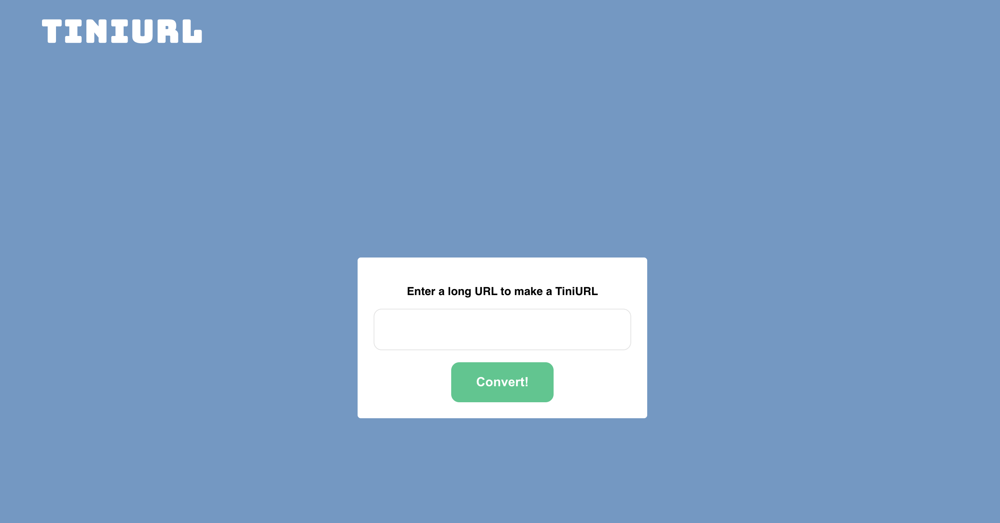
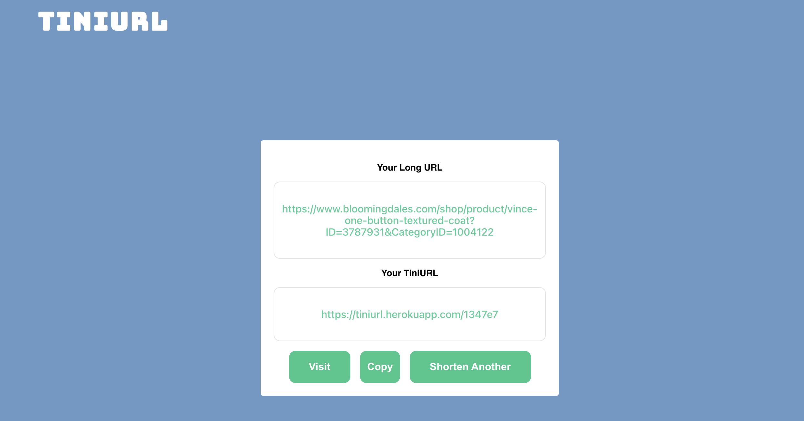

# TiniURL

\*\*It's Live! View it [here!](https://tiniurl.herokuapp.com/)

## Description

TiniUrl is a service that provide short aliases redirecting to long URLs. Users convert long URLs into shorter links that redirect to the original URL.

## Table of Contents

- [Technologies](#technologies)
- [Installation](#install)
- [Features](#features)
- [Future Features](#futurePlans)

## <a name="technologies"></a>Technologies

- [React](https://reactjs.org/docs/getting-started.html)
- [Flask](https://flask.palletsprojects.com/en/1.1.x/)
- [styled-components](https://styled-components.com/)
- [Heroku](https://www.heroku.com/) for deployment

## <a name="install"></a>Installation

Clone tiny_url repository

```
$ git clone https://github.com/JinaZhu/tiny_url.git
```

### Steps to get the Flask backend running:

**Make sure you are in the root project directory**

Install backend dependencies

```
$ pip install pipenv
```

go into virtualenv

```
$ pipenv shell
```

Install the backend dependencies

```
pipenv install
```

Create database

```
$ createdb url_converter
```

Create tables

```
$ flask create_tables
```

Run flask

```
$ flask run
```

### Steps to get the React frontend running:

Enter into client folder

```
cd client
```

Install the frontend dependencies

```
npm install
```

Run the frontend app

```
npm run start
```

## <a name="features"></a>Features

- Convert long urls into short links.
- Short link redirects to the original URL.
- Track the number of times a short link is used.
- Different users can input same URL and get their own short URL.

 

## <a name="futurePlans"></a>Future Features

- Enable sharing and sending TiniURLs through email and social media.
- Create account for users to keep track of converted links.
- Allow users to set expiration date to shorten link.
- Monthly cleanup for links that is inactive for a year.

Test it out! [HERE!](https://tiniurl.herokuapp.com/)
